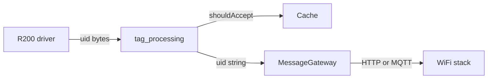

# Firmware architecture (ESP32 + R200)

This document describes how this PlatformIO project is structured: what lives where, how modules interact, and how a tag flows from the reader to the network stack.

---

## 1. Two zones: `src/` vs `lib/`

| Zone       | Role                                                                                                      |
| ---------- | --------------------------------------------------------------------------------------------------------- |
| **`src/`** | This firmware application: wiring, policy (when to log, when to send), and board-specific bring-up.       |
| **`lib/`** | Reusable building blocks usable in another sketch or in tests: R200 driver, UID cache, HTTP/MQTT gateway. |

**`lib/` should not encode business values**; **`src/`** owns those choices and calls into the libraries.

---

## 2. Configuration

### `src/config/app_config.h`

Single place for tunables:

- **Feature flags**: `MESSAGE_GATEWAY`, `GATEWAY_USE_MQTT`, `R200_LINK_TEST`, `USE_CONTINUOUS_POLL`, etc.
- **Hardware**: `R200_RX_PIN`, `R200_TX_PIN`, `R200_BAUD`, `UID_LEN`.
- **Timing**: poll interval, main-loop throttle, tag cooldown, heartbeat period, log throttle for garbage UID / cache-skip lines.
- **Identity**: `MQTT_NODE_ID` (from `mqtt_node_config.h` / env `NODE_ID`) for MQTT topics and payloads (`esp32_id`).

Flags can also be set from **`platformio.ini`** via `build_flags` (e.g. `-DMESSAGE_GATEWAY=0`).

### `src/secrets.h` / `secrets_example.h`

Credentials and URLs (Wi‑Fi, Lambda URL, API key). Use the example file as a template for sharing or version control without leaking secrets.

---

## 3. Network layer

### `src/net/connectivity.cpp` / `.h`

- **`connectivitySetup()`** — Wi‑Fi STA: connect with SSID/password from `secrets.h`, print status.
- **`connectivityLoop()`** — Hook for future behavior (reconnect, NTP, etc.); currently minimal.

---

## 4. RFID: hardware vs policy

### `src/rfid/rfid_hw.cpp` / `.h`

“Make the R200 UART work” for this board:

- Serial2 RX buffer, `begin()` with pins/baud, discard noise, optional link test, optional continuous polling, `dumpModuleInfo()` and a short pump so the driver can drain responses.

Depends on **`lib/R200/`** (protocol: frames, CRC, `poll()`, `loop()`, `uid[]`).

### `src/rfid/uid_utils.h`

Inline helpers: UID compare, all-zero check, hex string for logs, detection of known UART framing garbage (`0xDD 0xAA`).

### `src/rfid/tag_processing.cpp` / `.h`

Application **policy**, not the driver:

- Is a tag present (non-zero UID)?
- Garbage framing? → occasional log, no treat as real tag.
- Else ask **`Cache`** if this UID is allowed **now** (cooldown / LRU).
- If accepted → `TAG_LOG` + payload preview via **`MessageGateway::makeTagPayload`**; if **`MESSAGE_GATEWAY`** → **`sendTag()`**.

**`TagProcessorState`** holds throttling timestamps for log spam (garbage / cache skip).

---

## 5. Debouncing: `lib/Cache/Cache.h`

Template **`Cache<N>`** remembers recent UIDs and applies **per-UID cooldown** to limit Serial and cloud traffic when the same tag stays in the field. Generic and testable without Wi‑Fi or RFID hardware.

---

## 6. Cloud uplink: `lib/MessageGateway/`

- **`TransportMode`** — abstract: send a JSON string.
- **`Http`** — POST over HTTP/HTTPS (`WiFiClientSecure`, optional `x-api-key`).
- **`Mqtt`** — PubSubClient; **`loop()`** for keepalive and inbound handling.
- **`MessageGateway`** — picks payload shape (Lambda JSON vs MQTT JSON with `tag_id`, `ts`, `esp32_id`) and delegates **`send()`** to the active transport.

The app passes **hex UID strings** (and optional time via **`MessageGatewayConfig::timeProviderMs`**).

---

## 7. Transport selection: `src/gateway/transport_factory.cpp` / `.h`

Composition root for the gateway:

- **`GATEWAY_USE_MQTT`** → build **`Mqtt`** using **`kMqttTopicPrefix`**, **`MQTT_NODE_ID`**, **`kMqttHost`**, **`kMqttPort`**, **`kMqttClientId`**, **`kMqttRetain`**, **`kMqttUser`** / **`kMqttPass`**. Publish: `bicicletero/esp/<node_id>/requests`; subscribe: `…/responses` before publishing.
- Else → **`Http`** with **`GATEWAY_LAMBDA_URL`** and **`GATEWAY_X_API_KEY`** from **`secrets.h`** (URLs and API keys stay out of the main config header).

Keeps **`main.cpp`** free of `new Http(...)` / MQTT struct wiring.

---

## 8. Observability: `src/rfid/heartbeat.cpp` / `.h`

On **`kHeartbeatIntervalMs`**: always a serial line (uptime, Wi‑Fi, IP, heap, tag-present when the reader is active). If **`SYSTEM_MODE`** is **`SYSTEM_MODE_GATEWAY_INTERVAL`**, the same tick also sends telemetry through **`MessageGateway`** (same ingest as tags). There is no separate “heartbeat URL/topic” layer — only **`SYSTEM_MODE`** plus the main gateway transport.

---

## 9. `src/main.cpp`: orchestration

**`setup()`** — Serial banner → **`connectivitySetup()`** → **`setupR200Module()`** when **`SYSTEM_MODE_RFID`** (skipped in **`SYSTEM_MODE_GATEWAY_INTERVAL`**) → **`msgGw.begin()`** if gateway enabled.

**`loop()`** — **`connectivityLoop()`** → **`msgGw.loop()`** (MQTT, etc.) → **`logHeartbeat()`** on interval (gateway send only in **`SYSTEM_MODE_GATEWAY_INTERVAL`**) → when RFID mode: **`rfid.loop()`** + periodic **`poll()`** → throttle with **`kMainLoopIntervalMs`** → **`tagProcessorLoop(...)`** with shared state.

`main` schedules modules and passes references to **`R200`**, **`Cache`**, **`MessageGateway`**, and **`TagProcessorState`**; it does not implement tag policy itself.

---

## 10. End-to-end data flow

---

## 11. Why this layout

| Goal                | How it helps                                                                                    |
| ------------------- | ----------------------------------------------------------------------------------------------- |
| **Readability**     | Open `tag_processing` for tag rules; `MessageGateway` for wire format; `app_config` for tuning. |
| **Reuse**           | R200, Cache, MessageGateway can move to another project with small glue.                        |
| **Testing**         | `test/` can target Cache, UID helpers, or payload builders without full hardware.               |
| **Backend changes** | Swap HTTP ↔ MQTT or add a transport in the factory + `MessageGateway`.                          |

---

_Paths in this document are relative to the Firmware repository root._
