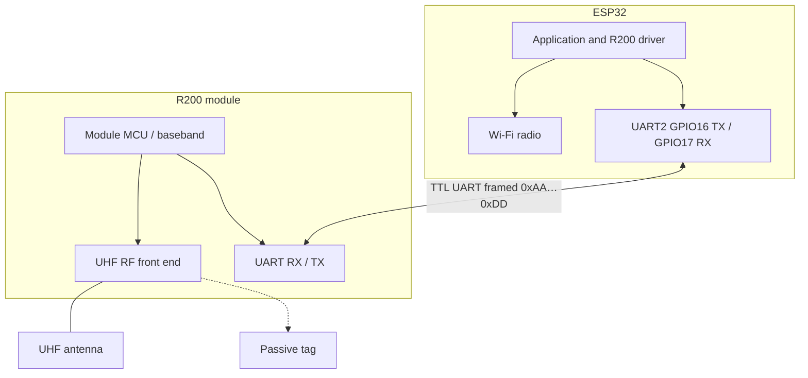

# Hardware: ESP32 and R200

This document names the main physical components and describes how the **Espressif ESP32** and the **R200** UHF RFID reader module interact at the electrical and logical level. Firmware details of the protocol implementation live in `lib/R200/`; the high-level software architecture is described in [ARCHITECTURE.md](ARCHITECTURE.md).

---

## 1. Components

| Name | Role |
|------|------|
| **ESP32** | Microcontroller (this project uses a common **ESP32-WROOM-32** class dev board, `esp32dev` in PlatformIO). It runs the firmware, hosts **Wi‑Fi** for cloud uplink, and drives the **UART** to the R200. |
| **R200** | UHF RFID **reader module** (UART-controlled). It performs RF inventory / reads EPC (and related) data from passive UHF tags and reports results to the MCU using a framed binary protocol. |
| **Antenna** | External UHF antenna, matched to the module and to the regulatory **band** (e.g. EU vs US). Not a digital signal to the ESP32; it is part of the R200 RF front end. |
| **Passive UHF tag** | RFID label or card in the reader’s field; powered by the reader’s RF. |

The firmware does not implement the RF physical layer; it only exchanges **UART frames** with the R200.

---

## 2. Electrical interface: what connects to what

### 2.1 UART (serial) — primary digital link

Communication uses **asynchronous serial (UART)** at **TTL logic levels** (typically **3.3 V** on both ESP32 and common R200 breakout boards). **Always confirm** supply and I/O voltage in your module’s datasheet before wiring.

Connections must be **crossed** (MCU TX → reader RX, MCU RX → reader TX):

| ESP32 signal | Direction | R200 signal | Notes |
|--------------|-----------|-------------|--------|
| **TX** (host → module) | Out | **RX** | Data and commands from ESP32 to R200. |
| **RX** (module → host) | In | **TX** | Responses and tag data from R200 to ESP32. |
| **GND** | Common | **GND** | **Mandatory** shared ground reference for UART and supply return. |

In this firmware (`src/config/app_config.h`), **UART2** is mapped as:

| Parameter | Value |
|-----------|--------|
| ESP32 **RX** (host receives from R200 TX) | **GPIO 17** |
| ESP32 **TX** (host sends to R200 RX) | **GPIO 16** |
| Default baud rate | **115200** |

If no tags or responses appear, **swap RX/TX** in software (`R200_RX_PIN` / `R200_TX_PIN`) or in wiring—mis‑crossed UART is the most common wiring error.

### 2.2 Power

- The **ESP32** is usually powered via USB or a regulated 5 V input on the dev board (on-board regulator feeds 3.3 V to the chip).
- The **R200** often requires a **stable** supply at its rated voltage (commonly **3.3 V** or **5 V** per module variant) and can draw **non-trivial peak current** during transmit. Powering the R200 **only** from a marginal 3.3 V rail shared with a flaky USB cable may cause brownouts or unreliable reads.
- **Do not** assume two unrelated “GND” nodes are the same; tie **ESP32 GND** and **R200 GND** together at the wiring harness.

### 2.3 Other pins

This project uses **no SPI or I2C to the R200** for the main protocol path: interaction is **UART-only** as implemented in `R200::begin(..., HardwareSerial *serial, ...)`.

---

## 3. Logical interaction: protocol on the wire

### 3.1 Framed binary protocol

Commands to the reader and responses from it use **fixed framing** (see `lib/R200/R200.h`):

- Frames start with header **`0xAA`** and end with **`0xDD`**.
- Fields include **type** (command vs response vs notification), **command code**, **parameter length**, **payload**, and a **checksum** (LSB of sum over selected bytes).

Example structure (conceptual):

`Header | Type | Command | ParamLength (2 B) | Parameter(s) | Checksum | End`

This is a **master–slave** style flow from the ESP32 perspective: the firmware sends commands (e.g. poll, get module info), and the R200 answers with structured responses; tag reads appear as parsed data ending up in the driver’s `uid[]` buffer after `loop()` / `poll()` processing.

### 3.2 Typical command families (names only)

The driver exposes operations such as **single poll**, **multiple poll** / streaming, **get module info**, **stop multiple poll**, and configuration commands (power, channel, region-related settings). Exact opcodes are defined in `R200_Command` in `R200.h`.

### 3.3 Software-side coupling

On the ESP32:

1. **`HardwareSerial`** instance **Serial2** is used with the pins above.
2. The RX buffer size is increased (e.g. **2048** bytes) before `begin()` to reduce overflow during bursts.
3. The main firmware calls **`rfid.loop()`** frequently and **`rfid.poll()`** on a timer when appropriate so incoming bytes are parsed into frames and UIDs.

So the **interaction** is: **interrupt-driven UART RX** → **frame parser** → **application** reads `uid[]` and applies policy (debouncing, gateway upload).

---

## 4. RF and mechanical (brief)

These are **not** GPIO signals between ESP32 and R200, but they determine whether reads succeed:

- **Antenna** must be compatible with the module’s frequency band and properly connected.
- **Tag** must be in the **read zone**, passive UHF, correct band.
- Environmental **metal** and **power quality** affect range and reliability.

---

## 5. Verification in firmware

The project can run a **UART link test** (`R200_LINK_TEST` / `rfid.linkTest()`): it sends a command such as **GetModuleInfo** and checks for a **valid framed response**. **PASS** indicates TX and RX paths are working end-to-end; **FAIL** usually points to **wrong TX/RX mapping**, **GND**, **baud mismatch**, or **power** to the R200.

---

## 6. Summary diagram (logical)

---

_Paths refer to the Firmware repository. Pin and baud defaults match `src/config/app_config.h` unless you override them._
